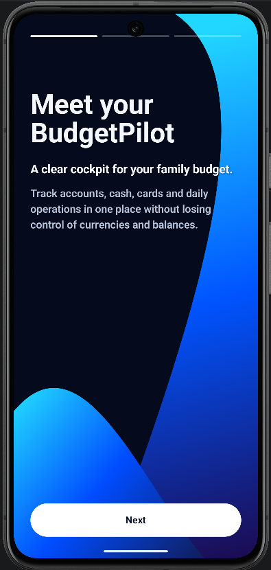
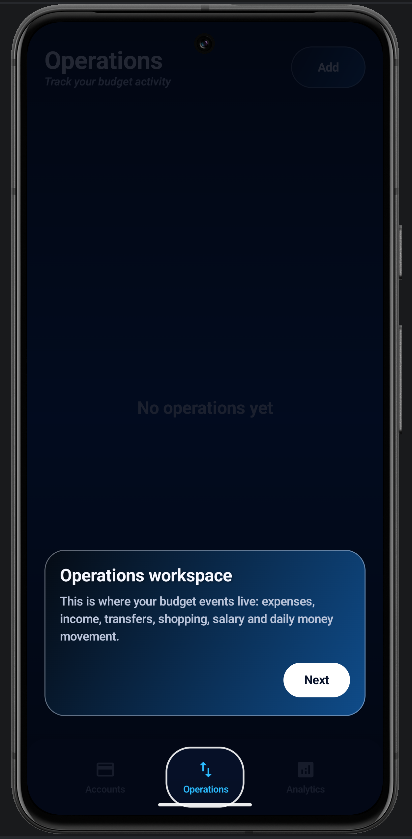
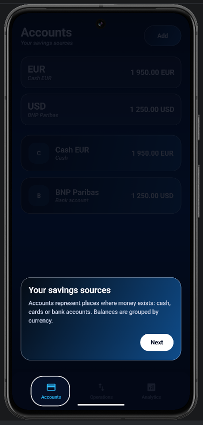
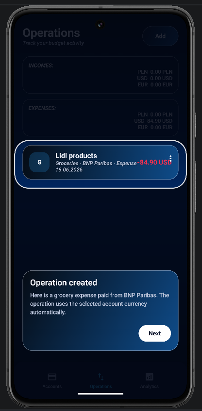
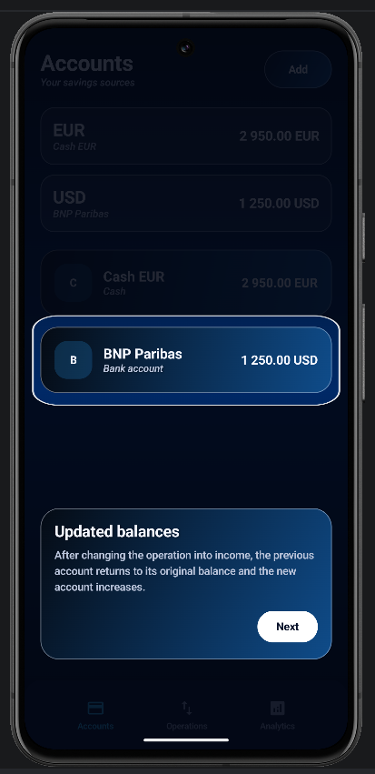
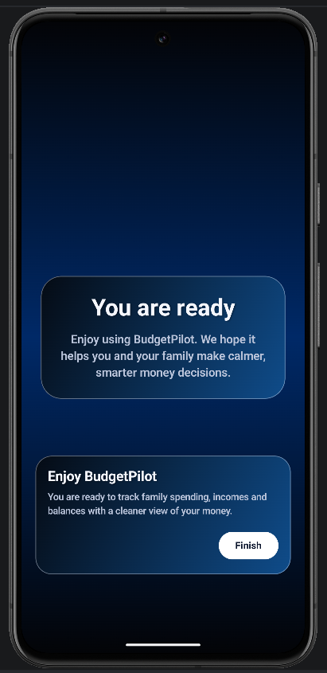
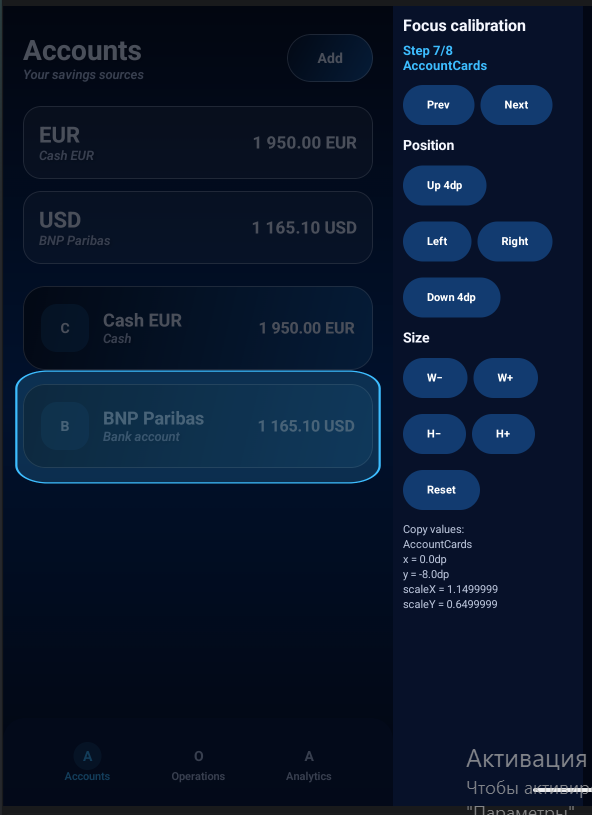

# BudgetPilot

<p align="center">
  
</p>

<p align="center">
  <strong>A clear financial cockpit for personal and household money.</strong>
</p>

<p align="center">
  <a href="https://developer.android.com/"></a>
  <a href="https://kotlinlang.org/"></a>
  
  
  
  
</p>

> [!IMPORTANT]
> **Investment and partnership opportunity:** BudgetPilot is open to early-stage investment, strategic product partnerships, and collaboration with people who share the vision of a privacy-conscious, dependable personal finance assistant. To start a conversation, use the [GitHub profile](https://github.com/petryniy1) or open a repository issue.

BudgetPilot is an Android application for tracking personal and household finances.

The app helps users manage cash and bank accounts, record income and expense operations, monitor balances in multiple currencies, and keep everyday financial activity understandable in one place.

BudgetPilot already provides a reliable local-first foundation for account and operation management. The project is being modernized into an extensible personal finance platform using a current Android stack, explicit business rules, reactive state, atomic database operations, reusable UI components, and testable architecture.

## Product roadmap at a glance

The roadmap is ordered by expected product impact. It intentionally focuses on user-facing capabilities rather than internal implementation details.

| Priority | Product direction | Planned value |
|---|---|---|
| 1 | **Bank synchronization** | Connect user accounts and import cashless transactions from supported banking providers. |
| 2 | **Receipt scanner and smart extraction** | Use receipt photos to extract the merchant, amount, date, line items, payment type, and suggested category. |
| 3 | **Account and cloud synchronization** | Optional Google sign-in, secure backup, device restoration, and user-owned cloud storage, starting with Google Drive. |
| 4 | **Financial analytics** | Interactive day, week, month, and year views with spending, income, balance, and category trends. |
| 5 | **Account-to-account transfers** | Move money between cash wallets and bank accounts while updating both balances atomically. |
| 6 | **Smart categorization** | Learn user associations, suggest categories from operation names, and automatically select relevant icons for groceries, pets, transport, home, and other spending. |
| 7 | **Savings goals** | Dedicated goal cards for planned purchases, emergency funds, family objectives, and progress tracking. |
| 8 | **Multi-currency overview** | Convert account balances into a user-selected base currency and show a consolidated portfolio total. |
| 9 | **Personal finance reminders** | Payment reminders and optional friendly notifications encouraging users to keep their daily operations up to date. |
| 10 | **Personalization and localization** | User profile, avatar, language settings, system-language detection, and selectable blue, red, green, yellow, or purple visual themes. Russian, Polish, and Spanish localizations are planned. |
| 11 | **Advanced transaction filters** | Filter by date, category, and account, combine criteria, and reset filters in one action. |

## Product walkthrough

The first-launch experience introduces BudgetPilot as a financial co-pilot and then guides the user through the relationship between accounts, operations, and balances.

<p align="center">
  
</p>

<p align="center">
  <strong>Meet your BudgetPilot</strong><br />
  A clear starting point for managing family accounts, currencies, and daily financial operations.
</p>

<table>
  <tr>
    <td align="center"><strong>Operations workspace</strong></td>
    <td align="center"><strong>Accounts and savings sources</strong></td>
  </tr>
  <tr>
    <td></td>
    <td></td>
  </tr>
  <tr>
    <td align="center">The tutorial explains where income, expenses, transfers, and daily money events live.</td>
    <td align="center">Accounts represent real sources of money and remain grouped by currency.</td>
  </tr>
</table>

<table>
  <tr>
    <td align="center"><strong>Operation created</strong></td>
    <td align="center"><strong>Balance recalculated</strong></td>
  </tr>
  <tr>
    <td></td>
    <td></td>
  </tr>
  <tr>
    <td align="center">A financial operation is connected to its account and uses the account currency.</td>
    <td align="center">Editing an operation rolls back its previous effect before applying the new balance change.</td>
  </tr>
</table>

<p align="center">
  
</p>

<p align="center">
  <strong>Ready to take control</strong><br />
  The guided flow ends with a clear transition into everyday use of the application.
</p>

### Developer tooling: focus calibration

The tutorial spotlight is configured through a dedicated interactive Compose preview. It allows developers to move and resize each focus area against realistic application states before transferring the calibrated values into the production tutorial.

<p align="center">
  
</p>

## Technology stack

BudgetPilot combines a modern Compose-based application flow with selected legacy XML components that are being migrated incrementally. This approach keeps the application usable while the architecture is improved in controlled vertical slices.

| Area | Technologies |
|---|---|
| Language and runtime | Kotlin, Java |
| Android platform | Android SDK |
| UI | Jetpack Compose, Material 3, XML layouts, ViewBinding, RecyclerView |
| Architecture | MVVM, Clean Architecture principles, feature-based presentation structure |
| Reactive state | Kotlin Coroutines, Flow, StateFlow, LiveData |
| Persistence | Room, SQLite, DAO, entities, migrations |
| Dependency injection | Hilt, KSP |
| Navigation | Jetpack Navigation Component, Safe Args |
| Lifecycle | AndroidX Lifecycle |
| Build system | Gradle, Android Gradle Plugin |
| Testing | JUnit, AndroidX Test, Espresso, in-memory Room integration tests, Coroutines Test |
| Development workflow | Git, GitHub, feature branches, pull requests, Compose previews |

### Why this stack works well

- **Jetpack Compose** makes the UI declarative, state-driven, reusable, and easier to preview without launching the complete application.
- **StateFlow and Flow** provide observable, lifecycle-friendly data streams from Room through the ViewModel to the UI.
- **Room transactions** keep an operation and its affected account balance consistent as one atomic database action.
- **Hilt** makes dependencies explicit and keeps repositories, managers, validators, policies, and ViewModels replaceable in tests.
- **Typed domain results** communicate exact outcomes such as validation errors, missing accounts, currency mismatch, or insufficient funds without relying on generic strings or Boolean values.
- **Incremental Compose migration** avoids a high-risk rewrite and allows the modern v1 flow to grow beside the older implementation until it can safely replace it.
- **Feature branches and pull requests** preserve a reviewable development history and make architectural decisions visible to technical reviewers.

## Current features

### Account management

- Create, edit, and delete cash or bank accounts.
- Store balances as integer minor units instead of floating-point values.
- Keep the currency inside the `Money` domain model.
- Group accounts by currency and calculate currency-level balance summaries.
- Prevent duplicate account names through a domain-level rule.
- Display typed account-action errors through UI state.

### Financial operations

- Create, edit, and delete income and expense operations.
- Associate every operation with an existing account.
- Keep the operation currency consistent with its account currency.
- Prevent expenses that exceed the available balance.
- Recalculate balances when an operation is edited.
- Restore account balances when an operation is deleted.
- Display income and expense totals grouped by currency.
- Keep the domain prepared for a future two-sided transfer flow.

### Local-first data

- Store accounts and operations locally with Room.
- Observe database changes through `Flow`.
- Map Room entities into Android-independent domain models.
- Use explicit Room migrations instead of destructive database recreation.
- Preserve operation and balance consistency with database transactions.

### Product experience

- Custom BudgetPilot launcher, adaptive icon, round icon, and monochrome themed icon.
- Branded Android system splash screen with a smooth exit transition.
- Three-part onboarding for first-time users.
- Ten-step guided tutorial covering Accounts, Operations, Add, Edit, balance changes, and completion.
- Real application navigation icons inside the tutorial.
- Transparent spotlight cutouts that leave focused UI elements clearly visible.
- Reusable Material 3 dialogs, dropdown menus, text fields, date fields, snackbars, and buttons.
- Custom scroll indicator for long dialog content.
- English interface with additional localizations planned.

### Filtering

The legacy application included transaction filtering concepts for date, category, account, and filter reset. These controls are being redesigned for the Compose-based v1 flow.

## Reliability by design

Financial operations should never update a transaction while leaving the account balance in a contradictory state. BudgetPilot therefore uses three complementary protection levels.

### 1. Domain validation and business rules

Before persistence, the domain layer verifies:

- operation title and amount validity;
- account existence;
- currency compatibility;
- sufficient funds;
- account name validity and uniqueness.

These checks return sealed, typed results that can be mapped into precise UI behavior.

### 2. Deterministic balance calculation

Balance changes are isolated behind dedicated domain services:

- `AccountBalanceCalculator` calculates the next balance;
- `AccountBalancePolicy` decides whether an operation is allowed;
- `BudgetOperationManager` coordinates validation, lookup, rollback, recalculation, and persistence.

Editing an operation first rolls back its previous balance effect and only then applies the updated operation. Deleting an operation applies the inverse balance change.

### 3. Atomic Room transactions

Creating, editing, or deleting an operation and updating the corresponding account balance happen inside the same Room transaction.

If either database action fails, the whole transaction is rolled back. This prevents partially saved financial state.

> **Interview-ready explanation:** the UI does not calculate financial balances and the ViewModel does not access Room directly. Business rules belong to domain services, repositories define data access boundaries, and DAOs remain responsible for SQL and persistence.

## Layer responsibilities

### Presentation layer

- Compose screens render state and send user events.
- Routes connect screens to ViewModels and convert editor data into domain input.
- ViewModels expose `StateFlow` and coordinate user actions.
- UI models and formatters prepare display-specific data.
- Android resources remain outside domain models.

### Domain layer

- Models represent accounts, money, currencies, and budget operations.
- Validators enforce input invariants.
- Managers coordinate business workflows.
- Policies decide whether balance-changing actions are allowed.
- Repository interfaces keep the domain independent from Room.
- Sealed result types make success and failure explicit.

### Data layer

- Room entities represent persisted records.
- DAOs contain database queries.
- Mappers translate between entities and domain models.
- Repository implementations convert technical failures into domain-facing results.
- Multi-record financial changes use `withTransaction`.

## Compose previews and UI calibration

The project contains dedicated previews for Accounts, Operations, Analytics, and tutorial scenarios. These previews are not decorative screenshots: they are part of the development workflow.

`GuidedTutorialFocusCalibrationPreview` provides:

- the same tutorial scenes used by the real application;
- previous and next step navigation;
- independent X and Y offset controls;
- independent width and height scaling;
- reset controls;
- copy-ready calibration values;
- real application navigation icons and shared focus configuration.

This allows spotlight targets to be positioned visually in Android Studio without repeatedly rebuilding and navigating through the complete application. Runtime and preview reuse the same tutorial steps and adjustment map, reducing configuration drift.

## Testing

The current test foundation demonstrates multiple test levels:

- **Unit tests** for `AccountValidator`.
- **Unit tests** for `OperationValidator`.
- **Instrumented Room integration test** for `AccountDao` using an in-memory database.
- Verification of inserted data, observed `Flow` values, and expected ordering.
- Coroutine test dependency prepared for future ViewModel and Flow tests.

Planned test expansion:

- manager and service tests with fake repositories;
- ViewModel state-transition tests;
- mapper and formatter tests;
- Compose component tests;
- navigation integration tests;
- end-to-end user-flow tests;
- screenshot regression tests;
- startup and scrolling performance benchmarks.

## Modernization strategy

BudgetPilot started as a traditional Android project and is being modernized without destabilizing the complete application at once.

The current strategy is:

1. Build a new v1 architecture beside the legacy implementation.
2. Establish Android-independent domain models and typed results.
3. Connect repositories, Room entities, DAOs, and mappers.
4. Move complete user flows to Compose one vertical slice at a time.
5. Protect important behavior with tests.
6. Remove the old layer only after the replacement flow is verified.

The modernization has already introduced account-based naming, feature-oriented presentation packages, StateFlow-based ViewModels, Compose screens, domain managers, validators, transactional repositories, onboarding, guided tutorial tooling, and automated tests.

## Product direction

BudgetPilot is designed to evolve from a dependable manual finance tracker into a proactive financial co-pilot.

The long-term product combines:

- private and understandable household finance tracking;
- automated transaction collection;
- receipt recognition;
- useful analytics instead of overwhelming dashboards;
- smart but user-controlled categorization;
- savings goals and payment reminders;
- optional cloud continuity across devices;
- personalization for different families, currencies, and languages.

The core architectural goal is to let these features grow without moving financial rules into the UI or coupling the domain model to a particular database, cloud provider, or Android resource.

## Project status

BudgetPilot is actively developed and currently serves three purposes:

1. A functioning foundation for a future personal finance product.
2. A portfolio project demonstrating modern Android engineering practices.
3. A practical modernization case study showing how a legacy application can move toward Compose and Clean Architecture incrementally.

The project is not presented as a finished banking product yet. Bank integrations, cloud synchronization, receipt recognition, extended analytics, localization, and production-grade security review remain roadmap work.

## Getting started

Requirements:

- Android Studio with support for the configured Android Gradle Plugin;
- a compatible JDK and Android SDK as defined by the Gradle configuration;
- an emulator or supported physical Android device.

```bash
git clone https://github.com/petryniy1/BudgetPilot.git
cd BudgetPilot
```

Open the project in Android Studio, allow Gradle synchronization to complete, select the `app` configuration, and run it on a device or emulator.

## Collaboration

Ideas, technical feedback, product discussions, and carefully scoped contributions are welcome through GitHub issues and pull requests.

For investment or strategic partnership discussions, contact the project owner through [GitHub](https://github.com/petryniy1).
